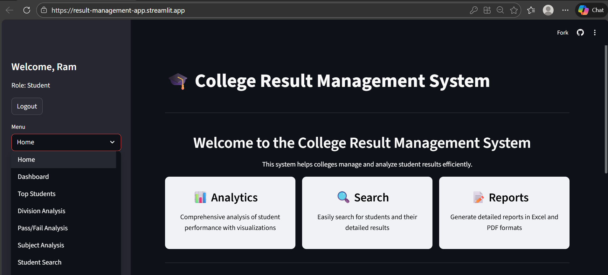
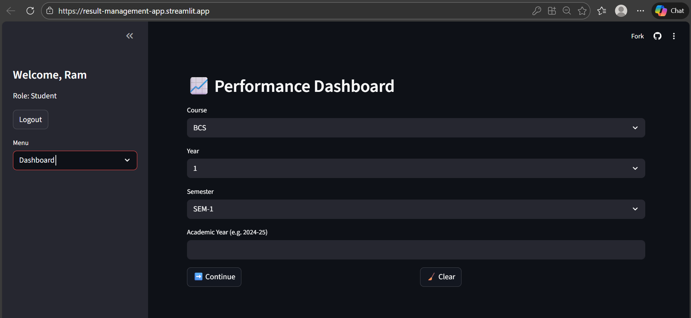
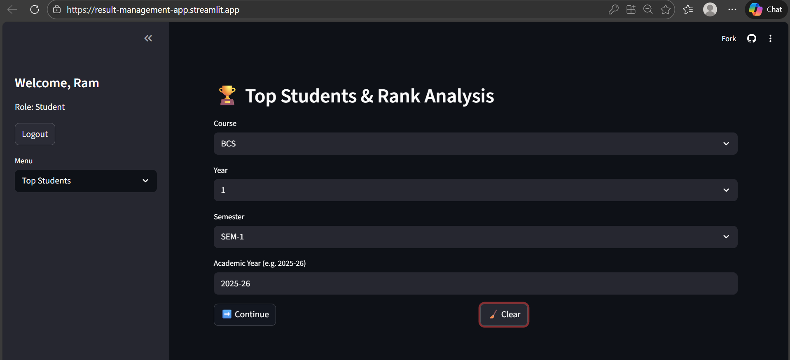
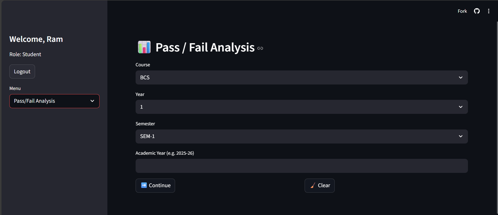

# 📘 College Result Management System


A comprehensive Streamlit web application for managing, analyzing, and visualizing college examination results.  
This system automates PDF result processing and provides powerful analytics tools for educators and administrators.

---

## Table of contents
- [Features](#features)
- [Demo / Screenshots](#demo--screenshots)
- [Tech stack](#tech-stack)
- [Requirements](#requirements)
- [Install & Run](#install--run)
- [Quick start](#quick-start)
- [Usage notes](#usage-notes)
- [Project structure](#project-structure)
- [Module documentation](#module-documentation)
- [Configuration](#configuration)
- [Development](#development)
- [Contributing](#contributing)
- [License & Acknowledgements](#license--acknowledgements)
- [Contact](#contact)

----

## 🎯 Features

### 🖼️ Core Functionality
- PDF result processing: extract student records from university result PDFs (names, seat numbers, subject-wise marks, totals, percentage, result status).
- Advanced analytics: class-level metrics, trends, distributions, and subject-wise insights.
- Multi-format export: generate Excel, PDF, and CSV reports for sharing and archiving.
- Responsive UI: designed to work on desktop, tablet, and mobile devices.

### 📋 Modules Overview

| Page                 | Icon | Description                                                      |
|----------------------|------|------------------------------------------------------------------|
| Upload PDF           | 📤   | Process university result PDFs and extract student data          |
| Performance Dashboard| 📈   | Class performance overview with metrics and trends               |
| View Top Students    | 🏆   | Identify and analyze top performers (89% and above)              |
| Division Analysis    | 📊   | Custom analysis by percentage ranges and student divisions       |
| Pass/Fail Analysis   | ✅   | Comprehensive pass/fail statistics and trends                    |
| Subject-wise Analysis| 📚   | Detailed performance analysis by individual subjects             |
| Student Search       | 🔍   | Advanced search for individual student records                   |
| Excel Report         | 📝   | Generate detailed Excel reports with complete student data       |

---

## 📊Demo / Screenshots

<div align="center">
 <table>
    <tr>
      <td>
        <a href="assets/images/Home.png">
          
        </a>
      </td>
      <td>
        <a href="assets/images/dashboard.png">
          
        </a>
      </td>
    </tr>
    <tr>
      <td align="center"><strong>Figure 1.</strong>Home Page</td>
      <td align="center"><strong>Figure 2.</strong> Performance dashboard</td>
    </tr>
    <tr>
      <td>
        <a href="assets/images/top-students.png">
          
        </a>
      </td>
      <td>
        <a href="assets/images/pass-fail.png">
          
        </a>
      </td>
    </tr>
    <tr>
      <td align="center"><strong>Figure 3.</strong> Top students</td>
      <td align="center"><strong>Figure 4.</strong> Pass - Fail analysis</td>
    </tr>
  </table>
</div>

---

## 🛠️Tech stack
- Frontend: Streamlit
- Language: Python 3.8+
- Data extraction: pdfplumber (PDF parsing)
- Data handling: pandas, numpy
- Charts: matplotlib (and optionally seaborn/plotly)
- Exports: openpyxl, fpdf (or reportlab)
- Utilities: PyYAML (config), scipy (optional analysis)

---

## ✅Requirements

- Python 3.8 or higher
- Internet connection (only needed for external resources if used)

Install dependencies:
```bash
pip install -r requirements.txt
```

Suggested packages (examples):
- streamlit
- pandas
- matplotlib
- pdfplumber
- openpyxl
- fpdf
- numpy
- scipy
- PyYAML

---

## 🚀Install & Run

1. Clone the repo:
```bash
git clone https://github.com/your-username/college-result-management-system.git
cd college-result-management-system
```

2. (Recommended) Create and activate a virtual environment:
```bash
# Windows
python -m venv venv
venv\Scripts\activate

# macOS / Linux
python3 -m venv venv
source venv/bin/activate
```

3. Install dependencies:
```bash
pip install -r requirements.txt
```

4. Run the app:
```bash
streamlit run app.py
```

Visit http://localhost:8501

---

## ⚡Quick start
- Upload PDF: Go to Upload PDF page → select your university result PDF → click Process.
- View results: Switch to Dashboard / Subject Analysis / Top Students to explore insights.
- Search student: Use Student Search to find records by name or seat number.
- Export: Use Excel Report or export buttons to download CSV/Excel/PDF outputs.

---

## ℹ️Usage notes
- The PDF parser relies on consistent result formatting. If PDFs vary by college/university, you may need to adjust parsing rules and regex.
- If marks extraction fails for some pages, try converting the PDF to a plain text-exportable version or updating the extraction patterns.
- Exported reports preserve timestamps and include processed metadata for traceability.

---

## 🏗️Project structure
```bash
college-result-management-system/
├── app.py                  # Main Streamlit application
├── requirements.txt        # Python dependencies
├── .streamlit/             # Streamlit configuration
│   └── config.toml
├── assets/                 # Images, logos and styling files
│   └── images/
└── pages/                  # Streamlit pages / modules
    ├── upload_pdf.py
    ├── dashboard.py
    ├── top_students.py
    ├── division_analysis.py
    ├── pass_fail_analysis.py
    ├── subject_analysis.py
    ├── student_search.py
    └── excel_report.py
```

---

## 📖 Module Documentation

### 📤 Upload PDF Module
File: `pages/upload_pdf.py`  
- Extracts structured student data from PDF documents using pdfplumber & regex.  
- Data includes: student info, subject-wise marks, totals, percentage, and pass/fail status.  
- Includes basic heuristics for multi-layout PDFs and a fallback manual entry UI.

---

### 📈 Performance Dashboard
File: `pages/dashboard.py`  
- Class-level performance metrics, trend charts, and distribution plots.  
- Visuals: histograms, KDE plots, pie charts for pass/fail and division composition.

---

### 🏆 Top Students
File: `pages/top_students.py`  
- Identifies and ranks students with 89%+ (configurable threshold).  
- Export ranked lists and save snapshots as Excel/PDF.

---

### 📊 Division Analysis
File: `pages/division_analysis.py`  
- Analyze student distribution across percentage ranges (e.g., 0–40, 41–60, 61–75, 76–89, 90+).  
- Export PDF/CSV summaries with tables and charts.

---

### ✅ Pass/Fail Analysis
File: `pages/pass_fail_analysis.py`  
- Subject-wise and overall pass/fail statistics.  
- Trend graphs to spot changes across semesters or batches.

---

### 📚 Subject Analysis
File: `pages/subject_analysis.py`  
- Determine subject difficulty via average scores and failure rates.  
- Correlation analysis between subjects and heatmaps of score distributions.

---

### 🔍 Student Search
File: `pages/student_search.py`  
- Search by `name`, `seat number`, or use filters (division, percentage range).  
- Detailed student view shows subject-wise marks and computed metrics.

---

### 📝 Excel Report
File: `pages/excel_report.py`  
- Generate styled Excel reports with workbook tabs for overview, subject summaries, and full student list.  
- Supports CSV and PDF export options.

---

## 🔧Configuration

### Streamlit Configuration (`.streamlit/config.toml`)
```toml
[server]
headless = true

[client]
showSidebarNavigation = false

[runner]
magicEnabled = false
```

### Environment Variables
```bash
# Toggle maintenance mode
export MAINTENANCE_MODE=false

# Default UI theme (light or dark)
export DEFAULT_THEME=light
```

---

## 🧩Development
- Recommended workflow: create a feature branch for changes (e.g., `feature/pdf-parser-improvement`).
- Add unit tests for parsing logic where possible (example: expected parsed output for sample PDFs).
- Lint and format with `black` and optionally `flake8` for style consistency.
- Consider adding persistent storage (SQLite / small DB) for storing processed results across sessions.

---

## 🤝Contributing
Contributions are welcome:
1. Fork the repository
2. Create a feature branch: `git checkout -b feature/your-feature`
3. Commit your changes with descriptive messages
4. Open a pull request describing the change and providing testing instructions

Please keep changes focused and testable for easier review.

---

## 📝License & Acknowledgements
- This project is provided for personal and educational use.
- Acknowledgements:
  - Streamlit — UI framework
  - pdfplumber — PDF extraction
  - pandas / NumPy — data processing
  - matplotlib / seaborn — visualizations
  - openpyxl / fpdf — export utilities

---

## 📬Contact

<div align="center">

### **Vishal Bhingarde**

*React Developer | DSA Learner | Frontend Enthusiast*

[](https://linkedin.com/in/vishal-bhingarde-bb23a2376)
[](https://github.com/Vishal710-max)
[](https://portfolio-sect.vercel.app)
[](mailto:bhingardevishal5@gmail.com)

</div>

---

## ⭐ Show Your Support

If you found this project helpful, please give it a ⭐️!

<div align="center">

**Made with ❤️ by Vishal Bhingarde**

[](https://github.com/Vishal710-max/Collage-Result-management-System)
[](https://github.com/Vishal710-max/Collage-Result-management-System/fork)

</div>

---

<div align="center">


